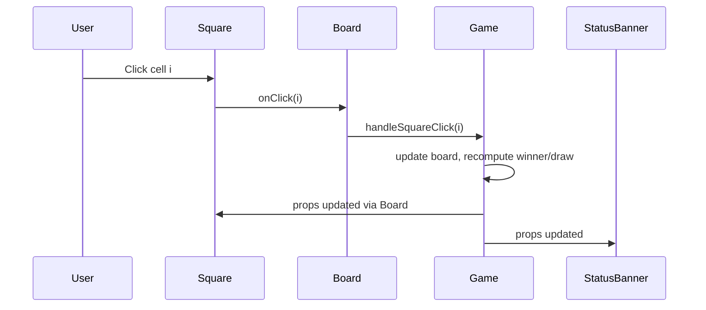

# Tic Tac Toe Frontend – Architecture

## Overview
This document describes the architecture of the Tic Tac Toe frontend built with React. It covers component structure, state management, game logic for win/draw detection, data flow, UI layout, styling, environment configuration, and build/deploy considerations.

## Goals and Principles
- Keep it simple: small component hierarchy, clear responsibilities.
- Separation of concerns: UI components vs. game logic utilities.
- Accessibility-first and theme-aligned.
- Testable logic for win/draw detection.

## Component Structure
- App
  - Responsibilities: Page layout, theme surface, holds Game component.
- Game
  - Responsibilities: Owns game state (board, current player, winner/draw), renders status, Board, and Restart button.
- Board
  - Responsibilities: Renders a 3x3 grid of Square components; passes click events up.
- Square
  - Responsibilities: Render a single cell with “X” or “O”; handle user click; reflect disabled state.
- StatusBanner
  - Responsibilities: Display current status (turn, win, draw) with semantic markup for accessibility.

Example conceptual tree:
- App
  - Game
    - StatusBanner
    - Board
      - Square × 9
    - RestartButton

## State Management
- Local component state in Game component.
  - board: string[] of length 9 where entries are "X" | "O" | "".
  - xIsNext: boolean to track the current player.
  - winner: "X" | "O" | null.
  - isDraw: boolean derived when board is full and winner is null.
- Derived state calculated via pure functions:
  - calculateWinner(board): returns "X", "O", or null.
  - isBoardFull(board): returns boolean.

Rationale: The app is small; lifting state to a global store is unnecessary. Co-locating state with Game improves maintainability and testability.

## Game Logic
- Winning combinations:
  - Rows: [0,1,2], [3,4,5], [6,7,8]
  - Columns: [0,3,6], [1,4,7], [2,5,8]
  - Diagonals: [0,4,8], [2,4,6]
- Algorithm:
  - On each click: if square is empty and no winner, set square to current player, then recompute winner; if no winner and board is full, set draw.

Reference implementation (illustrative):
```javascript
// utils/gameLogic.js
export const LINES = [
  [0,1,2], [3,4,5], [6,7,8],
  [0,3,6], [1,4,7], [2,5,8],
  [0,4,8], [2,4,6],
];

export function calculateWinner(board) {
  for (const [a,b,c] of LINES) {
    if (board[a] && board[a] === board[b] && board[a] === board[c]) {
      return board[a];
    }
  }
  return null;
}

export function isBoardFull(board) {
  return board.every(cell => cell);
}
```

## Data Flow
- Top-down unidirectional flow:
  - Game holds state and handlers.
  - Board receives board array and onSquareClick(index).
  - Square receives value and onClick, notifies parent on interaction.
- StatusBanner reads derived state from Game to present status text.
- RestartButton triggers Game.reset() to clear all state.

Mermaid sequence for a move:


## UI Layout and Styling
- Layout
  - Centered vertical stack:
    - StatusBanner above
    - Board (3x3 grid) centered
    - Restart button below
- Theme (light, modern, minimalistic)
  - Background: #f9fafb
  - Surface: #ffffff
  - Text: #111827
  - Accent primary: #3b82f6
  - Accent success: #06b6d4
- Implementation Options
  - CSS Modules, Styled Components, Tailwind CSS, or simple CSS files; choose a minimal approach (e.g., CSS Modules) to keep bundle small.
- Accessibility
  - Squares use button semantics with aria-pressed and labels.
  - StatusBanner uses role="status" or aria-live="polite".
  - Focus ring visible and keyboard navigation supported.

## Environment Configuration
The app recognizes the following environment variables (prefixed per Create React App conventions or similar tooling):
- REACT_APP_API_BASE
- REACT_APP_BACKEND_URL
- REACT_APP_FRONTEND_URL
- REACT_APP_WS_URL
- REACT_APP_NODE_ENV
- REACT_APP_NEXT_TELEMETRY_DISABLED
- REACT_APP_ENABLE_SOURCE_MAPS
- REACT_APP_PORT
- REACT_APP_TRUST_PROXY
- REACT_APP_LOG_LEVEL
- REACT_APP_HEALTHCHECK_PATH
- REACT_APP_FEATURE_FLAGS
- REACT_APP_EXPERIMENTS_ENABLED

Usage guidance:
- Feature flags (REACT_APP_FEATURE_FLAGS, REACT_APP_EXPERIMENTS_ENABLED) may toggle optional UI (e.g., winning-line highlight).
- Logging (REACT_APP_LOG_LEVEL) governs console verbosity or an optional lightweight logger wrapper.
- Source maps and telemetry flags control build-time behavior in development vs production.

## Build and Deploy Considerations
- Development
  - Run dev server on port 3000.
  - Use fast-refresh for quick iteration.
- Production Build
  - Optimize bundle size; ensure source maps behavior aligns with REACT_APP_ENABLE_SOURCE_MAPS.
  - Set REACT_APP_NODE_ENV appropriately for conditional logic.
- Deployment
  - Any static hosting (Netlify, Vercel, GitHub Pages, S3) or containerized deployment.
  - Healthcheck path can be served as a lightweight route or static file if needed (REACT_APP_HEALTHCHECK_PATH).
- Observability
  - Console logs gated by REACT_APP_LOG_LEVEL.
  - Optional integration with web analytics or error tracking can be feature-flagged off by default.

## Test Strategy
- Unit Tests
  - utils/gameLogic: calculateWinner and isBoardFull with positive and negative cases.
- Component Tests
  - Game interactions: clicking squares toggles players, winner and draw states.
  - Restart clears state and UI.
- Accessibility Checks
  - Basic automated checks with jest-axe or eslint-plugin-jsx-a11y.
- Manual Testing
  - Cross-browser smoke test on latest Chrome, Firefox, Safari, Edge.
  - Responsive layout checks.

## Logging and Error Handling
- Logging
  - Wrap console logging with a tiny logger that respects REACT_APP_LOG_LEVEL.
- Error Handling
  - Defensive guards against invalid moves (ignore clicks on filled squares or when game ended).
  - Fallback UI for unexpected errors using React error boundaries if desired (optional).

## Future Enhancements
- AI opponent (minimax) as an optional mode.
- Online multiplayer using WebSockets (REACT_APP_WS_URL).
- Persistence of game history in localStorage.
- Animations for winning line and transitions.
